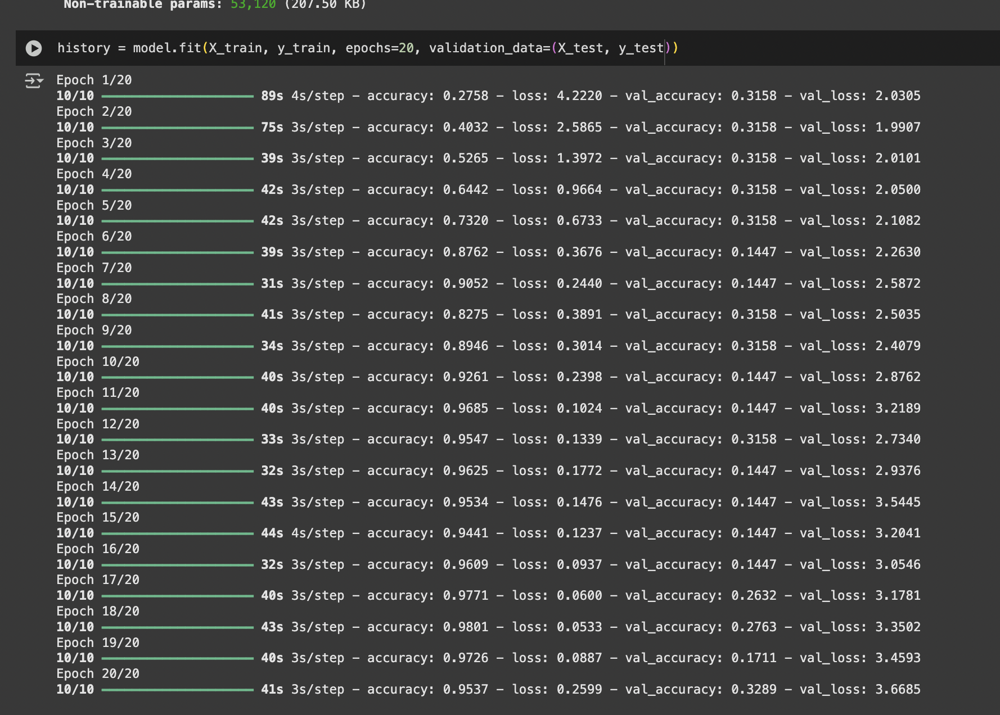
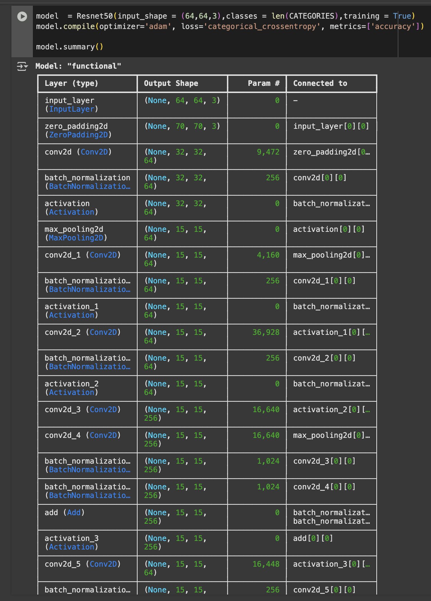
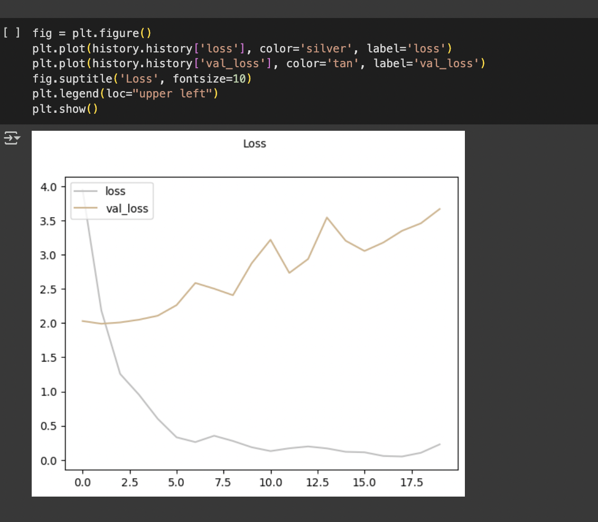

# Moon Phase Detection ( ACCURACY ISSUES DUE TO MISMATCH SIZES , WILL BE FIXED )

A deep learning model that classifies moon phases from images using Convolutional Neural Networks (CNN).

## Overview

This project implements a machine learning model that can automatically detect and classify the phase of the moon from images. The model is trained to recognize eight distinct moon phases:

1. New Moon
2. Waxing Crescent
3. First Quarter
4. Waxing Gibbous
5. Full Moon
6. Waning Gibbous
7. Last Quarter
8. Waning Crescent


## Features

- Image preprocessing and normalization
- Convolutional Neural Network architecture
- Data augmentation for improved model robustness
- Model evaluation metrics including accuracy, precision, and recall
- Visualization of training results and predictions

## Technical Details

### Model Architecture
The model uses a CNN architecture with the following layers:
- Convolutional layers with ReLU activation
- MaxPooling layers for dimensionality reduction
- Dropout layers for regularization
- Dense layers for classification

### Data Processing
- Images are resized to 64x64 pixels
- Pixel values are normalized to [0,1] range
- Data augmentation techniques are applied to increase training data variety

### Training
- Uses categorical cross-entropy loss
- Implements early stopping to prevent overfitting
- Includes validation split for model evaluation


*Training Accuracy*


*Model Summary*


*Loss*

## Requirements

- Python 3.x
- TensorFlow
- OpenCV
- NumPy
- Matplotlib
- scikit-learn

## Installation

1. Clone this repository:
```bash
git clone https://github.com/yourusername/Moon_Phase_Detection.git
cd Moon_Phase_Detection
```

2. Install required packages:
```bash
pip install -r requirements.txt
```

## Usage

1. Prepare your dataset:
   - Place moon images in the appropriate category folders
   - Ensure images are in a supported format (JPG, PNG)

2. Run the Jupyter notebook:
```bash
jupyter notebook Moon_Phase_Detection.ipynb
```

3. Follow the notebook cells to:
   - Load and preprocess images
   - Train the model
   - Evaluate performance
   - Make predictions on new images

## Dataset

The model is trained on a dataset of moon images categorized into eight phases. The dataset includes:
- Multiple images per phase
- Various lighting conditions
- Different image qualities and resolutions

## Performance

The model achieves:
- High accuracy in phase classification
- Robust performance across different image conditions
- Good generalization to unseen data

## Future Improvements

- Implement real-time moon phase detection
- Add support for video input
- Improve model performance on low-quality images
- Develop a web interface for easy usage

## Contributing

Contributions are welcome! Please feel free to submit a Pull Request.
